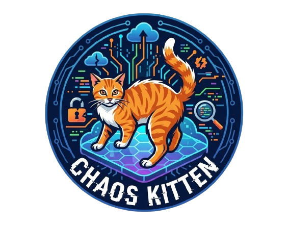

<p align="center">
  
</p>

<h1 align="center">
  
</h1>

<p align="center">
  <em>The adorable AI agent that knocks things off your API tables</em>
</p>

<p align="center">
  <a href="https://opensource.org/licenses/MIT">
    
  </a>
  <a href="https://www.python.org/downloads/">
    
  </a>
  <a href="https://www.cncf.io/">
    
  </a>
  <a href="https://github.com/mdhaarishussain/chaos-kitten/stargazers">
    
  </a>
</p>

<p align="center">
  <a href="#-quick-start">Quick Start</a> •
  <a href="#-features">Features</a> •
  <a href="#-how-it-works">How It Works</a> •
  <a href="#-installation">Installation</a> •
  <a href="#-contributing">Contributing</a>
</p>

---

## 🎯 What is Chaos Kitten?

<table>
<tr>
<td width="60%">

**Chaos Kitten** is an **agentic AI security testing tool** that acts like a mischievous cat—it explores your API, understands the business logic, and systematically tries to "break" things before malicious actors do.

Unlike traditional fuzzers (ZAP, Burp) that spray random payloads, Chaos Kitten **reasons** about your API structure and crafts **intelligent attacks**.

</td>
<td width="40%">

```
� Agent thinks...
"This is a login endpoint.
I should test for:
- SQL injection in username
- User enumeration
- Brute force protection"
```

</td>
</tr>
</table>

---

## 🤔 The Problem

AI-powered "vibe coding" tools (Claude, Cursor, Windsurf) generate backend APIs at incredible speed, but they often skip critical security measures:

<table>
<tr>
<td align="center" width="25%">
  <h3>❌</h3>
  <strong>Missing Auth</strong><br>
  <sub>No authentication on critical endpoints</sub>
</td>
<td align="center" width="25%">
  <h3>❌</h3>
  <strong>No Validation</strong><br>
  <sub>Input fields accept anything</sub>
</td>
<td align="center" width="25%">
  <h3>❌</h3>
  <strong>SQL Injection</strong><br>
  <sub>Queries built with string concatenation</sub>
</td>
<td align="center" width="25%">
  <h3>❌</h3>
  <strong>Logic Flaws</strong><br>
  <sub>IDOR, privilege escalation</sub>
</td>
</tr>
</table>

> **Real Story:** While building [Bondhu](https://bondhu.tech) (Digital Twin for mental wellness), we discovered our AI vibe coded frontend had ZERO authentication on critical endpoints. Anyone could exploit this to access user data.

**Chaos Kitten finds these issues before attackers do.** 🔒

---

## ✨ Features

<table>
<tr>
<td width="50%">

### 🧠 The Brain (AI Orchestrator)
- Parses OpenAPI/Swagger specs
- Understands endpoint semantics
- Plans intelligent multi-step attacks
- Uses Chain-of-Thought reasoning

### � The Paws (Executor)
- Async HTTP with `httpx`
- Playwright browser automation
- Rate limiting & politeness controls
- Multiple auth methods

</td>
<td width="50%">

### 🧶 The Toy Box (Attack Library)
- SQL Injection profiles
- XSS payloads (reflected, stored)
- IDOR detection strategies
- Naughty strings collection
- *Easy to contribute!*

### 📦 The Litterbox (Reporter)
- Beautiful HTML reports
- Markdown export
- PoC curl commands
- Remediation guidance

</td>
</tr>
</table>

---

## �🚀 Quick Start

```bash
# Install
pip install chaos-kitten

# Initialize config
chaos-kitten init

# Run against your API
chaos-kitten scan --config chaos-kitten.yaml
```

### Example Output

```ansi
🐱 Chaos Kitten v1.0.0
📋 Parsing OpenAPI spec...
🎯 Found 12 endpoints
🧠 Planning attack strategies...

🐾 Testing /api/login
   ⚠️  I knocked this vase over! (SQL Injection found)

🐾 Testing /api/users/{id}
   ⚠️  I played with this string! (IDOR vulnerability)

📊 Report saved to ./reports/chaos-kitten-2026-01-20.html
```

---

## 🏗️ Architecture

```
┌─────────────────────────────────────────────────────────────────┐
│                        🐱 Chaos Kitten                          │
├─────────────────────────────────────────────────────────────────┤
│                                                                  │
│   ┌────────────────┐           ┌────────────────┐               │
│   │   🧠 Brain     │───────────│   🐾 Paws      │               │
│   │  Orchestrator  │           │   Executor     │               │
│   │                │           │                │               │
│   │  • OpenAPI     │           │  • httpx       │               │
│   │  • LLM Agent   │           │  • Playwright  │               │
│   │  • Planner     │           │  • Async       │               │
│   └───────┬────────┘           └───────┬────────┘               │
│           │                            │                         │
│           └────────────┬───────────────┘                         │
│                        │                                         │
│              ┌─────────▼─────────┐                               │
│              │   🧶 Toy Box      │                               │
│              │  Attack Profiles  │                               │
│              │                   │                               │
│              │  • SQL Injection  │                               │
│              │  • XSS Payloads   │                               │
│              │  • IDOR Tests     │                               │
│              └─────────┬─────────┘                               │
│                        │                                         │
│              ┌─────────▼─────────┐                               │
│              │   📦 Litterbox    │                               │
│              │    Reporter       │                               │
│              │                   │                               │
│              │  • HTML Reports   │                               │
│              │  • PoC Scripts    │                               │
│              │  • Remediation    │                               │
│              └───────────────────┘                               │
│                                                                  │
└─────────────────────────────────────────────────────────────────┘
```

---

## 📦 Installation

### From PyPI (Recommended)

```bash
pip install chaos-kitten
```

### From Source

```bash
git clone https://github.com/mdhaarishussain/chaos-kitten.git
cd chaos-kitten
pip install -e .
```

### With Development Dependencies

```bash
pip install -e ".[dev]"
```

---

## ⚙️ Configuration

Create a `chaos-kitten.yaml` file:

```yaml
target:
  base_url: "http://localhost:3000"
  openapi_spec: "./openapi.json"
  auth:
    type: "bearer"
    token: "${API_TOKEN}"

agent:
  llm_provider: "anthropic"
  model: "claude-3-5-sonnet-20241022"
  temperature: 0.7

executor:
  concurrent_requests: 5
  timeout: 30
  rate_limit: 10

safety:
  allowed_domains:
    - "localhost"
    - "*.test.com"
  destructive_mode: false
```

> 📄 See [chaos-kitten.yaml](chaos-kitten.yaml) for all configuration options.

---

## 🔄 Retry Logic & Rate Limiting

Chaos Kitten includes sophisticated retry logic to handle rate-limited responses (HTTP 429) and transient server errors.

### Automatic Retry Behavior

The executor automatically retries requests that receive:
- **429** - Too Many Requests (rate limited)
- **500** - Internal Server Error
- **502** - Bad Gateway
- **503** - Service Unavailable  
- **504** - Gateway Timeout

### Configuration

Configure retry behavior in your `chaos-kitten.yaml`:

```yaml
executor:
  rate_limit: 10          # Requests per second

retry:
  # Maximum number of retry attempts
  max_attempts: 5
  
  # Initial backoff in milliseconds (grows exponentially)
  initial_backoff_ms: 100
  
  # Maximum backoff time in milliseconds
  max_backoff_ms: 32000
  
  # Multiplier for exponential backoff (2.0 = double each try)
  backoff_multiplier: 2.0
  
  # Randomness added to backoff: 0-10% variation
  jitter_factor: 0.1
  
  # Retry strategy: exponential|linear|fixed|adaptive
  # - exponential: Doubles each retry (100ms, 200ms, 400ms, ...)
  # - linear: Increases linearly (100ms, 200ms, 300ms, ...)
  # - fixed: Same delay each retry (100ms, 100ms, 100ms, ...)
  # - adaptive: Slower exponential growth for better distribution
  strategy: exponential
  
  # Respect the Retry-After HTTP header from server
  respect_retry_after: true
  
  # Which status codes trigger a retry
  retry_on_status_codes: [429, 500, 502, 503, 504]
```

### Backoff Strategies

**Exponential Backoff** (Default - Recommended)
```
Attempt 1: Wait 100ms, retry
Attempt 2: Wait 200ms, retry
Attempt 3: Wait 400ms, retry
Attempt 4: Wait 800ms, retry
Attempt 5: Wait 1600ms, fail
```

**Linear Backoff**
```
Attempt 1: Wait 100ms, retry
Attempt 2: Wait 200ms, retry
Attempt 3: Wait 300ms, retry
```

**Fixed Backoff** (Simple)
```
Attempt 1-4: Always wait 100ms, retry
Attempt 5: Fail
```

**Adaptive Backoff** (Best for unpredictable networks)
```
Slower growth curve - better for recovering from congestion
```

### Jitter

All strategies include optional jitter (randomness) to prevent "thundering herd" problems:

```yaml
retry:
  strategy: exponential
  initial_backoff_ms: 100
  jitter_factor: 0.1  # Adds 0-10% randomness
```

With jitter, multiple clients won't all retry at the same time.

### Metrics & Monitoring

Access retry metrics after execution:

```python
async with Executor(base_url="http://api.example.com") as executor:
    result = await executor.execute_attack(...)
    
    metrics = executor.get_metrics()
    print(f"Rate limited: {metrics['rate_limited_requests']} times")
    print(f"Total backoff: {metrics['total_backoff_time_ms']}ms")
    print(f"Successful retries: {metrics['successful_retries']}")
```

Metrics include:
- `total_requests` - Total requests attempted
- `rate_limited_requests` - How many 429 responses received
- `retried_requests` - How many requests were retried
- `successful_retries` - Retries that eventually succeeded
- `failed_retries` - Retries that failed after max attempts
- `total_backoff_time_ms` - Total time spent waiting
- `rate_limit_rate` - Percentage of requests rate limited

---

## 🎮 Usage

### Basic Scan

```bash
chaos-kitten scan --target http://localhost:3000
```

### With OpenAPI Spec

```bash
chaos-kitten scan --spec openapi.json --target http://localhost:3000
```

### CI/CD Integration

```yaml
# .github/workflows/security-test.yml
name: 🐱 Chaos Kitten Security Scan

on: [pull_request]

jobs:
  security-scan:
    runs-on: ubuntu-latest
    steps:
      - uses: actions/checkout@v4
      - name: Run Chaos Kitten
        run: |
          pip install chaos-kitten
          chaos-kitten scan --fail-on-critical
```

---

## 🎁 Contributing

We **love** contributions! Chaos Kitten is designed to be beginner-friendly.

<table>
<tr>
<td align="center" width="33%">

### 🐣 First-Timers
*No coding required!*

- Add payloads to `toys/`
- Fix typos in docs
- Add naughty strings

</td>
<td align="center" width="33%">

### 🐥 Beginners
*Basic Python*

- Write unit tests
- Create YAML attack profiles
- Add CLI features

</td>
<td align="center" width="33%">

### 🐔 Advanced
*Core Features*

- New attack strategies
- GraphQL support
- LLM optimization

</td>
</tr>
</table>

See [CONTRIBUTING.md](CONTRIBUTING.md) and [docs/contributing_guide.md](docs/contributing_guide.md) for details.

---

## 🔒 Safety & Ethics

> ⚖️ **LEGAL NOTICE**
>
> Chaos Kitten is intended for testing **YOUR OWN** applications or systems where you have **explicit permission**. Unauthorized access to computer systems is illegal. Users are responsible for compliance with applicable laws. The developers assume no liability for misuse.

### Built-in Safeguards

| Feature | Description |
|---------|-------------|
| ✅ **Allowlist-Only** | Won't scan domains not in `allowed_domains` |
| ✅ **Rate Limiting** | Respects server resources |
| ✅ **Non-Destructive** | Prevents DROP/DELETE by default |
| ✅ **Audit Logging** | All actions logged |

---

## 🗺️ Roadmap

<table>
<tr>
<td width="33%">

### Phase 1 (MVP) ✅
- [x] OpenAPI parsing
- [x] SQL injection detection
- [x] XSS & IDOR detection
- [x] HTML/Markdown reports
- [x] CLI tool

</td>
<td width="33%">

### Phase 2 🔄
- [ ] GraphQL support
- [ ] gRPC/Protobuf
- [ ] WebSocket testing
- [ ] GitHub Action

</td>
<td width="33%">

### Phase 3 🚀
- [ ] Kubernetes Operator
- [ ] Service Mesh integration
- [ ] Real-time dashboard
- [ ] OPA integration

</td>
</tr>
</table>

---

## 🏆 Built For

<p align="center">
  <strong>Aperture 3.0</strong> by <a href="https://github.com/resourcio">Resourcio Community</a>
</p>

---

## 📄 License

MIT License - see [LICENSE](LICENSE) for details.

---

<p align="center">
  
  <br><br>
  <strong>Chaos Kitten</strong>
  <br>
  <em>"Breaking your code before hackers do"</em>
  <br><br>
  Made with 💜 by the Chaos Kitten Team
  <br>
  A project under the <b>Last Neuron Umbrella</b>
  <br>
  <i>(By the makers of <a href="https://bondhu.tech">Bondhu</a>)</i>
</p>

<p align="center">
  <a href="https://github.com/mdhaarishussain/chaos-kitten/stargazers">⭐ Star us on GitHub</a>
</p>
